# Final Report

## Southeast Asia and the AI Labour Shock

### A Comparative Big Data Analysis with China as a Benchmark


**Course:** STQD6324 Data Management  

**Dataset:** World Bank Open Data API  

**Analysis period:** 2015–2024  


## 1. Introduction


I chose this topic because I am studying in Malaysia and I have been genuinely curious about how different Southeast Asian countries actually are from each other — not just in terms of GDP or general development, but in terms of how their labour markets are structured and how ready they are for the kind of changes that AI is starting to bring.


A lot of what I read about AI and labour markets is either very optimistic or very alarmist, and most of it is written about the US or Europe. I wanted to look at Southeast Asia specifically, using actual data, and see what the numbers say.


I also added China as an external benchmark. China has gone through rapid industrialisation, has a very large labour force, and has been investing heavily in digital infrastructure. I thought it would be a useful comparison point. What I did not expect was that China would end up with one of the highest employment vulnerability scores in the dataset. After checking the numbers, it made sense — China's industrial employment structure and labour-market pressure indicators push the vulnerability index up. But its digital readiness is also very high, so the final risk gap is slightly negative. That made the benchmark more interesting to interpret than I initially thought.


The core question is simple: which Southeast Asian countries are more exposed to AI-related labour market vulnerability, and which ones have the digital infrastructure to absorb that pressure?


To answer this, I built two indices — the Employment Vulnerability Index (EVI) and the Digital Readiness Index (DRI) — and compared them across eight Southeast Asian countries over 2015 to 2024. China was used only as an external benchmark. It was not included in the Southeast Asian regional average or the K-means clustering sample.


## 2. Data Collection and Management


### 2.1 Data Source


All data comes from the World Bank Open Data API. I downloaded data for 9 countries across 8 indicators, covering 2015 to 2025. This produced 72 API requests in total, all successful with no duplicates or failed calls. The raw downloaded dataset contained 792 rows. After excluding 2025, the expected formal analysis panel contained 720 country-indicator-year records. Two missing Laos 2024 DRI values were then identified and handled through forward fill, producing a complete final core panel.


The 8 indicators split into two groups:


EVI indicators:

- Industrial employment (% of total employment) — `SL.IND.EMPL.ZS`

- Agricultural employment (% of total employment) — `SL.AGR.EMPL.ZS`

- Services employment (% of total employment) — `SL.SRV.EMPL.ZS`

- Total unemployment rate — `SL.UEM.TOTL.ZS`

- Youth unemployment rate — `SL.UEM.1524.ZS`


DRI indicators:

- Internet users (% of population) — `IT.NET.USER.ZS`

- Mobile cellular subscriptions (per 100 people) — `IT.CEL.SETS.P2`

- Fixed broadband subscriptions (per 100 people) — `IT.NET.BBND.P2`


### 2.2 Why These Indicators


The EVI indicators reflect how exposed a country's labour force may be to structural disruption. High industrial employment means more workers are in manufacturing and production-related activities, which are increasingly affected by automation. High agricultural employment can reflect a more traditional labour structure with limited flexibility. High unemployment, especially youth unemployment, suggests the labour market is already under pressure before AI-related changes arrive.


Services employment is more complicated. A high service sector share could mean exposure to AI-affected jobs like customer service, clerical work, and routine administrative tasks. But it could also reflect a more modern and digitally adaptable economy. Because the direction is ambiguous, I did not include services employment in the main EVI. Instead I used it in a robustness version and tested whether country rankings would change when it was included. The ranking changes were small, which gave me more confidence in the main index design.


One thing worth noting about the DRI indicators: mobile cellular subscriptions can exceed 100 per 100 people because one person can hold multiple SIM cards or mobile contracts. This is normal and the data is not wrong. It does mean that countries with very high mobile penetration rates, like Thailand, will have their DRI pulled up more by this indicator than a simple percentage-based variable would. This becomes relevant when interpreting why Thailand clusters with Singapore in the K-means result.


The DRI indicators measure whether a country has the basic digital infrastructure to adapt. They are not a perfect measure of AI readiness, but they are the most consistently available proxies across the countries and years in this dataset.


### 2.3 Why 2025 Was Excluded


I downloaded data through 2025 to capture the most recent available records. But after running a coverage audit — checking completeness by indicator, by country, and by year — I found that 2025 had only 63.89% completeness across the full dataset. The missing values were concentrated in the DRI indicators, which have longer reporting lags than employment indicators.


Including 2025 would have made the DRI calculation unreliable for the most recent year, and that would have distorted both the risk gap and the trend analysis. So I set the formal analysis period to 2015–2024 and kept the 2025 data only in the raw audit files.


This was not a decision I made upfront. I made it after seeing the coverage results. The raw data, audit files, and the full reasoning are documented in `01_data_availability_audit/outputs/data_decision_summary.txt`.


### 2.4 Missing Value Handling


After restricting the dataset to 2015–2024, the core indicator panel had only two missing values: Laos 2024 mobile cellular subscriptions and Laos 2024 fixed broadband subscriptions.


I used forward fill to impute these — the 2023 values were carried forward to 2024. This is a reasonable assumption for slowly changing infrastructure indicators, but it is still an assumption. I documented both the imputation method and its limitations in `01_data_availability_audit/outputs/worldbank_imputation_audit_2015_2024.csv`.


After imputation, the core dataset contained 720 complete rows:


```text

9 countries × 8 indicators × 10 years = 720 rows

```


### 2.5 Data Management Summary


The main work in this stage was not fixing messy raw data — World Bank API data is already standardised. The real work was building a reliable analysis panel with documented decisions at every step.


Main steps:

- Downloaded raw data via World Bank API (792 rows, 2015–2025)

- Ran a three-layer coverage audit by indicator, country, and year

- Excluded 2025 after the audit showed 63.89% completeness

- Applied forward fill for two missing Laos 2024 DRI values

- Verified the final 2015–2024 panel had 720 complete rows

- Saved audit outputs, imputation records, and a decision summary for reproducibility


All decisions are recorded in `01_data_availability_audit/outputs/data_decision_summary.txt`. This file was auto-generated during the audit run, so the content matches the actual processing steps exactly.


## 3. Index Construction and Methodology


### 3.1 Overview


The main analytical framework has two parts. First, I built EVI and DRI for each country and year. Then I used the risk gap — the difference between the two — to compare countries and track changes over time.


The index construction and risk gap calculation were applied to all 9 countries including China. This means China participates in the normalization so that its scores are on the same scale as the Southeast Asian countries. However, China does not participate in the SEA median calculation or the K-means clustering. It is only used as a visual and numerical benchmark.


### 3.2 Normalization


Before building the indices, I applied min-max normalization to all 8 indicators across all 9 countries and all 10 years together.


The formula is:


```text

normalized = (value - min) / (max - min)

```


This rescales every indicator to a 0–1 range, where 0 is the lowest value observed across all countries and years, and 1 is the highest. This makes the indicators comparable even though they are measured in different units.


One thing worth noting: mobile cellular subscriptions can exceed 100 because one person can hold multiple SIM cards. In this dataset, the minimum observed value was around 51 and the maximum was around 181. This means the normalization range for mobile subscriptions is larger than for indicators capped at 100. Countries with very high mobile penetration, like Thailand, will have their normalized mobile score pushed up significantly. This is not a data error — it reflects the real distribution of the indicator.


Each indicator has a normalization direction. For vulnerability indicators, a higher raw value means higher vulnerability, so a higher normalized score means more vulnerable. For digital readiness indicators, a higher raw value means better readiness, so a higher normalized score means better prepared.


Services employment is the exception. A higher service employment share could mean more exposure to AI-affected jobs, but it could also mean a more modern economy. Because the direction is not clear, I flagged it in the normalization metadata as a robustness assumption rather than treating it as a confirmed vulnerability signal.


All normalization decisions — directions, min and max values, and assumptions — are recorded in `02_index_calculation/outputs/normalization_metadata_2015_2024.csv`.


### 3.3 Employment Vulnerability Index (EVI)


The main EVI uses four indicators:


```text
EVI_main = 0.30 × ind_emp_n
         + 0.20 × agr_emp_n
         + 0.25 × unemp_n
         + 0.25 × youth_unemp_n
```


Where `_n` means the normalized version of each indicator.


The weights reflect how directly each indicator relates to AI-related labour vulnerability. Industrial employment gets the highest weight because manufacturing jobs are among the most directly targeted by automation. Unemployment and youth unemployment each get 0.25 because they capture current labour market stress — if a country is already struggling with unemployment, an additional shock will hit harder. Agricultural employment gets 0.20 because it reflects structural vulnerability, but it is somewhat less directly tied to AI displacement than industrial work.


These are project-defined analytical weights, not official weights. They are documented in `02_index_calculation/outputs/index_formula_metadata_2015_2024.csv`.


Services employment is not in the main EVI because the direction is ambiguous, as explained in Section 2.2. I built two robustness versions to test what happens when it is included:


```text

EVI_robust_010 = 0.90 × EVI_main + 0.10 × srv_emp_n

EVI_robust_020 = 0.80 × EVI_main + 0.20 × srv_emp_n

```


The robustness results are in Section 3.6.


### 3.4 Digital Readiness Index (DRI)


DRI is a simple equal-weighted average of the three normalized digital indicators:


```text

DRI = (net_user_n + mobile_sub_n + broadband_n) / 3

```


I used equal weights because there is no strong theoretical reason to weight one digital indicator above another. Internet access, mobile connectivity, and fixed broadband each capture a different dimension of digital infrastructure.


### 3.5 Risk Gap


The risk gap is the main comparison metric:


```text

risk_gap = EVI - DRI

```


A positive risk gap means employment vulnerability is higher than digital readiness. A negative risk gap means digital readiness may be sufficient to offset some of the vulnerability pressure.


One thing to keep in mind: a negative risk gap does not mean a country is fully safe. It just means the digital infrastructure side is relatively stronger than the vulnerability side, based on these specific indicators.


### 3.6 Robustness Check


To test whether the main EVI results depend on the decision to exclude services employment, I compared 2024 country rankings under three versions of EVI:


- EVI\_main — no services employment

- EVI\_robust\_010 — services employment at 10% weight

- EVI\_robust\_020 — services employment at 20% weight


Results showed that 5 out of 9 countries had identical rankings across all three versions. No country's ranking changed by more than one position. This suggests the main EVI design is stable and the results are not sensitive to the services employment assumption.


The full comparison is in `02_index_calculation/outputs/robustness_rank_comparison_2024.csv`.


### 3.7 Quadrant Analysis


For the 2024 quadrant analysis, I split countries into four categories using the median EVI and median DRI of the eight Southeast Asian countries as thresholds:


```text

High EVI + Low DRI → high vulnerability, low readiness

High EVI + High DRI → high vulnerability, high readiness

Low EVI + High DRI → low vulnerability, high readiness

Low EVI + Low DRI → low vulnerability, low readiness

```


China is shown in the quadrant plot but does not participate in the threshold calculation. The medians are computed from the eight SEA countries only.


The quadrant thresholds for 2024 are recorded in `02_index_calculation/outputs/quadrant_threshold_metadata_2024.csv`.


### 3.8 K-means Clustering


For clustering, I used K-means with k=3 on the eight Southeast Asian countries only. China was excluded from the clustering sample.


The input features were the 2019–2024 average EVI and DRI for each country. I used a six-year average rather than a single year to reduce the effect of year-to-year fluctuation. I did not include risk\_gap as a feature because it is directly derived from EVI and DRI — including it would give the same information twice.


K-means was used as an exploratory clustering method to identify countries with similar EVI-DRI profiles. Later, in the Spark validation stage, I tested multiple random seeds and selected the lowest-cost Spark model to check whether the Python clustering result was reproducible across environments.


After clustering, I labeled each cluster based on whether its centroid EVI and DRI were above or below the SEA median of the 2019–2024 average values:


```text

Cluster label = vulnerability level + readiness level

Example: High vulnerability - Low readiness

```


The cluster labels and thresholds are recorded in `02_index_calculation/outputs/cluster_label_threshold_metadata_2019_2024.csv`.


### 3.9 Quadrant vs K-means Comparison


I also compared the quadrant classification and K-means cluster label for each of the eight SEA countries to see whether the two methods agreed.


The result was 6 out of 8 countries matched. Indonesia and the Philippines were the two divergent cases. This is not a calculation error. Quadrant analysis uses fixed thresholds based on SEA medians, so it classifies countries independently based on where they fall relative to those cutoffs. K-means uses distance-based grouping, so it considers how countries relate to each other in the EVI-DRI space. A country that sits just above the quadrant threshold might still end up grouped with lower-risk countries in K-means if it is closer to that cluster's centroid.


The full agreement table is in `02_index_calculation/outputs/quadrant_cluster_agreement_2019_2024.csv`.


## 4. Analytical Results


### 4.1 2024 Risk Gap Overview


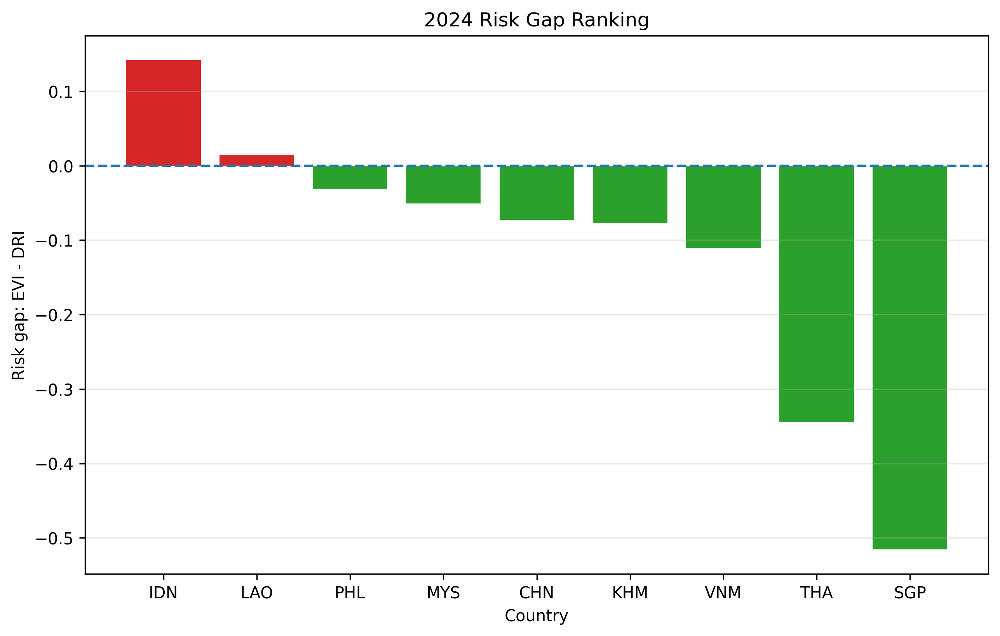


Indonesia has the highest positive risk gap in 2024, meaning its employment vulnerability is notably higher than its digital readiness. Laos is also slightly positive. All other Southeast Asian countries — the Philippines, Malaysia, Cambodia, Vietnam, Thailand, and Singapore — have negative risk gaps in 2024. In terms of the EVI minus DRI formula, this means their digital readiness score is slightly or clearly higher than their employment vulnerability score. However, this should not be read as equal preparedness across countries, because some countries, such as the Philippines, still have below-median DRI.


Singapore has the most negative risk gap, reflecting its very strong digital infrastructure relative to its employment vulnerability level.


China, shown as an external benchmark, also has a slightly negative risk gap. But this does not mean China is in a low-vulnerability position. Its EVI is actually the highest in the dataset. Its digital readiness is also very high, which is what brings the risk gap into negative territory. This is different from Singapore. Singapore has below-median EVI and very high DRI, while China has the highest EVI in the dataset and also the highest DRI. Both countries have negative risk gaps, but the underlying reasons are different.


### 4.2 2024 EVI Ranking


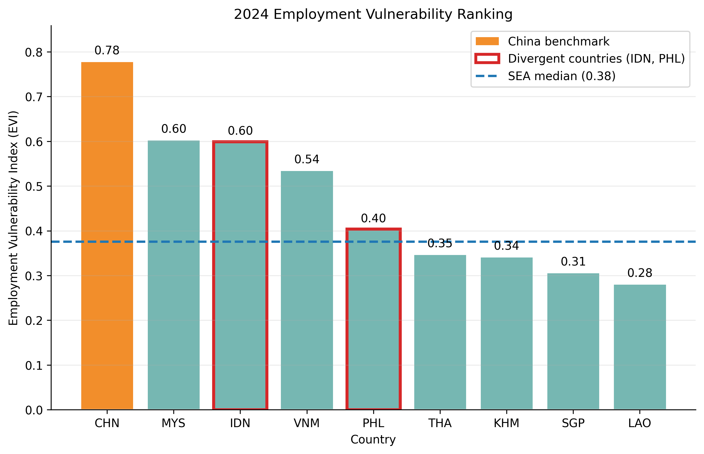


China has the highest EVI in 2024. Among the Southeast Asian countries, Malaysia and Indonesia are the next two highest, followed by Vietnam. Philippines is above the SEA median. Thailand, Cambodia, Singapore, and Laos are below the median.


The dashed line in the figure marks the SEA median EVI. Countries above it have relatively higher employment vulnerability within the region.


### 4.3 2024 DRI Ranking


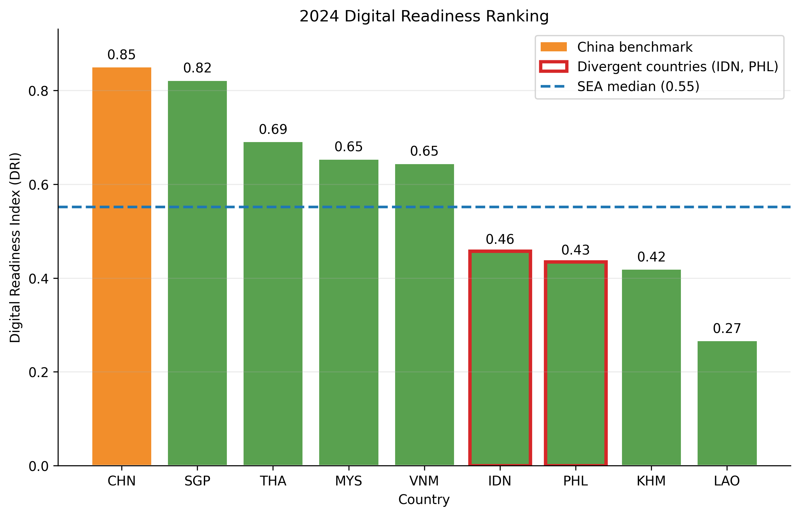


China has the highest DRI in 2024. Among the Southeast Asian countries, Singapore comes second, followed by Thailand. Malaysia and Vietnam are also above the SEA median. Indonesia, Philippines, Cambodia, and Laos are all below the median.


This is important for understanding the risk gap results. Indonesia and Philippines both have relatively high EVI but low DRI, which is why their risk gaps are high or close to zero. Thailand has a lower EVI but a high DRI, which is why its risk gap is strongly negative.


### 4.4 2024 Quadrant Analysis


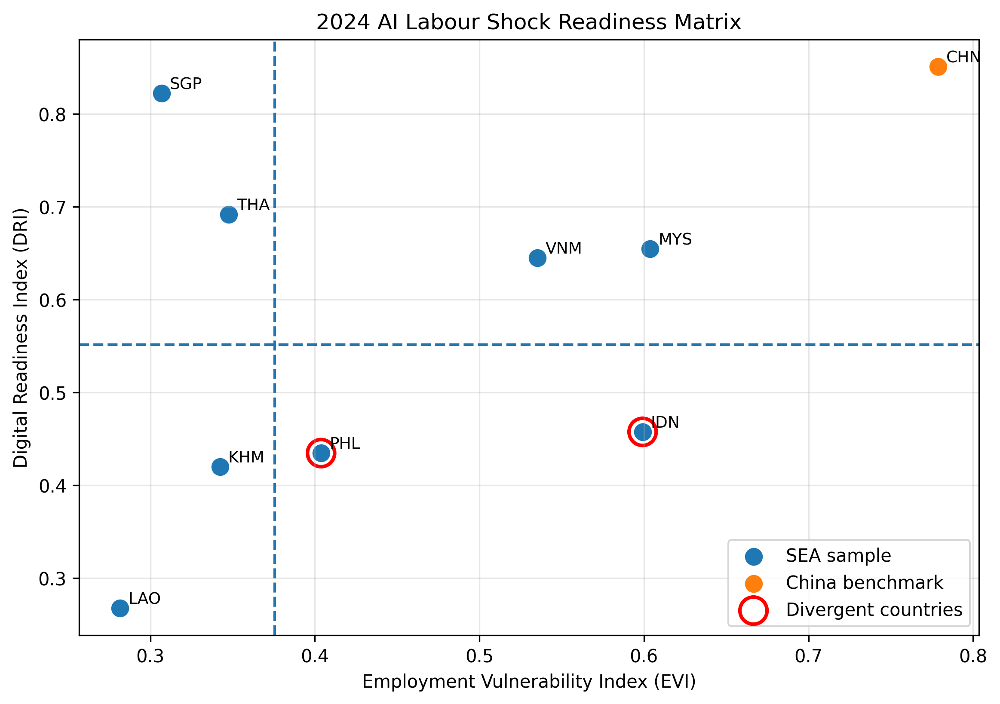


The quadrant plot uses the SEA median EVI and SEA median DRI as thresholds to classify countries into four groups.


Indonesia and the Philippines fall in the high EVI, low DRI quadrant — the highest-risk position. Both countries have employment vulnerability above the SEA median and digital readiness below it.


Malaysia and Vietnam fall in the high EVI, high DRI quadrant. They have relatively high vulnerability, but their digital readiness is also strong enough to partially offset it.


Singapore and Thailand fall in the low EVI, high DRI quadrant. Both have below-median vulnerability and above-median digital readiness.


Laos and Cambodia fall in the low EVI, low DRI quadrant. This is not a safe position — it suggests that current measured vulnerability is lower, but their digital readiness is also weak. Their limited digital readiness means they are also not well-positioned to adapt when that pressure does arrive.


China is shown in the plot as an external benchmark but does not participate in the threshold calculation. Based on its scores, it falls in the high EVI, high DRI area — similar to Malaysia and Vietnam, but with significantly higher values on both dimensions.


### 4.5 K-means Clustering (2019–2024 Average)


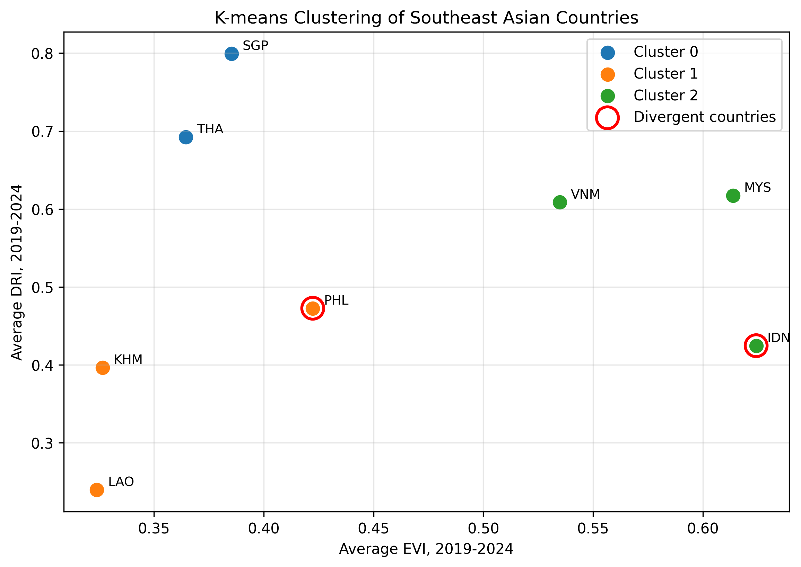


The K-means result groups the eight Southeast Asian countries into three clusters based on their 2019–2024 average EVI and DRI.


**Cluster: Low vulnerability, High readiness — Singapore, Thailand**  

Both countries have below-median EVI and above-median DRI. Thailand's inclusion here might look surprising given that it is not as digitally advanced as Singapore in general terms. But K-means groups by indicator values, not by general development level. Thailand's high mobile subscription rate pushed its DRI up enough to place it in the same cluster as Singapore.


**Cluster: Low vulnerability, Low readiness — Cambodia, Laos, Philippines**  

This cluster is mainly characterised by low digital readiness. Laos and Cambodia have clearly low EVI and low DRI. The Philippines is more borderline because its EVI is higher than Laos and Cambodia, but its overall EVI-DRI position is still closer to this group than to the other clusters. This is why K-means groups the Philippines with Laos and Cambodia, even though the quadrant analysis places the Philippines in a higher-risk category.


**Cluster: High vulnerability, High readiness — Malaysia, Vietnam, Indonesia**  

This cluster has above-median EVI and above-median DRI as a group. However, Indonesia is in this cluster because of its high EVI, not because of strong DRI. Its DRI is noticeably lower than Malaysia and Vietnam. The cluster centroid is pulled up by Malaysia and Vietnam, so the cluster label describes the group-level pattern better than Indonesia's individual profile. This is one of the reasons Indonesia appears as a divergent case in the quadrant vs K-means comparison.


### 4.6 Quadrant vs K-means Divergence


The quadrant analysis and K-means clustering agree on 6 out of 8 Southeast Asian countries. Indonesia and the Philippines are the two divergent cases.


In the quadrant analysis, both Indonesia and the Philippines fall in the high EVI, low DRI category — the highest-risk position. But in K-means, Indonesia is grouped with Malaysia and Vietnam under a high EVI, high readiness label, and the Philippines is grouped with Laos and Cambodia under a low EVI, low readiness label.


This divergence is not a calculation error. It comes from a fundamental difference between the two methods.


Quadrant analysis classifies each country independently based on whether it is above or below fixed SEA median thresholds. It does not consider what other countries look like. Indonesia is above the EVI median and below the DRI median, so it goes into the high EVI, low DRI quadrant regardless of what Malaysia or Vietnam look like.


K-means groups countries by minimising within-cluster distance. It looks at how countries relate to each other in the EVI-DRI space. Indonesia's EVI is similar to Malaysia and Vietnam, so it ends up in the same cluster even though its DRI is weaker. The Philippines has a moderately high EVI but low DRI, yet it ends up grouped with Laos and Cambodia because their overall EVI-DRI distance is small.


The practical takeaway is that threshold-based classification and distance-based clustering answer slightly different questions. Quadrant analysis is better for identifying whether a specific country crosses a risk threshold. K-means is better for identifying groups of countries with similar overall profiles. For borderline or mixed-profile countries like Indonesia and the Philippines, the two methods give different but both defensible answers.


The full comparison table is in `02_index_calculation/outputs/quadrant_cluster_agreement_2019_2024.csv`.


### 4.7 Risk Gap Trend (2015–2024)


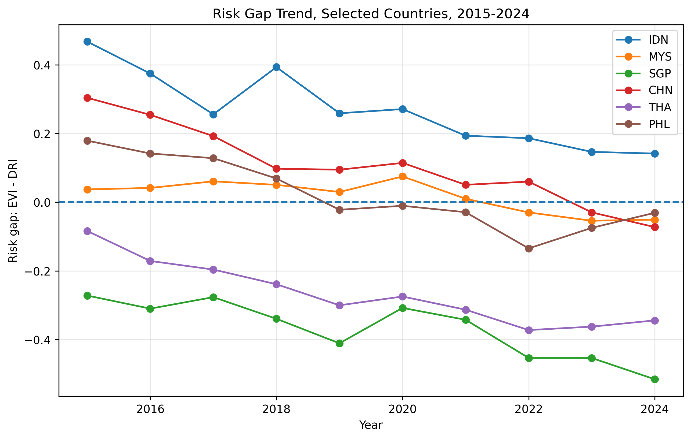


The trend chart shows how risk gaps changed over time for selected countries.


Indonesia has had a consistently positive risk gap throughout the period and remains the highest in 2024. Its digital readiness has improved, but not fast enough to close the gap with its employment vulnerability.


Singapore has maintained a strongly negative risk gap throughout, reflecting persistent digital infrastructure strength relative to employment vulnerability.


Thailand's risk gap has remained negative and has generally moved further below zero. This means its digital readiness has increasingly exceeded its employment vulnerability under this index.


China's risk gap started positive in 2015 and gradually moved into negative territory. This reflects rapid digital infrastructure development outpacing the growth of employment vulnerability indicators.


Malaysia's risk gap moved from a small positive to a small negative over the period, suggesting gradual convergence between vulnerability and readiness.


The Philippines moved from a positive risk gap toward near-zero or slightly negative in recent years, but the trend is less stable than Malaysia's.


The trend chart shows selected countries only. Based on the separate SEA yearly average output, the regional average risk gap was positive in 2015 and turned negative around 2018–2019. This suggests that, on average, digital readiness gradually caught up with employment vulnerability across Southeast Asia. But the regional average covers significant variation between countries, and Indonesia in particular remains an outlier with a persistently positive risk gap.


## 5. Big Data Toolchain Validation


### 5.1 Overview


The Python pipeline handled the main analysis — data collection, index construction, clustering, and visualisation. The Hadoop toolchain was used as a separate validation and data management layer to check that the results were consistent, reproducible, and manageable outside of the Python environment.


Each tool had a specific role:


- **Hive** — structured SQL validation of row counts, rankings, and trends

- **Spark** — independent recalculation of EVI, DRI, and risk gap from the long-format core indicator data, plus K-means reproducibility check

- **Pig** — lightweight ETL audit of the long-format core indicator dataset

- **HBase** — NoSQL country-year profile store for key-based lookup


The input files for the Hadoop toolchain were prepared in `04_bigdata_toolchain/bigdata_input/`. The original indicator data includes a field called `indicator_name` which contains embedded commas that would break comma-delimited parsing in Hive and Pig. The bigdata_input files remove this field and keep only the columns needed for toolchain validation. Header and no-header versions were both generated — no-header versions for Hive and Pig, header versions for Spark.


All input files were uploaded to HDFS at `/user/maria_dev/labour_shock/input/`.


### 5.2 Hive Structured Query Validation


Hive external tables were created pointing directly to the HDFS CSV files. Three tables were created:


- `country_year_index` — the full EVI/DRI/risk gap panel (90 rows)

- `core_long` — the long-format core indicator dataset (720 rows)

- `sea_cluster` — the K-means cluster result (8 rows)


Tables were created in Hive CLI because DDL execution in Zeppelin `%sh` was interrupted by paragraph timeout in the sandbox environment. Queries were then run through Zeppelin `%sql`, which produced clean table output for each result.


**Row count validation**


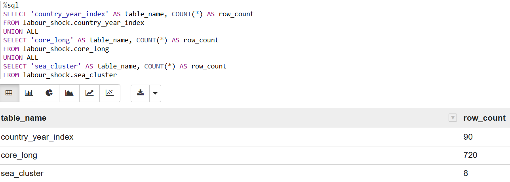


The first query confirmed that all three tables loaded correctly:


```text

country_year_index = 90 rows

core_long = 720 rows

sea_cluster = 8 rows

```


This matches the expected structure: 9 countries × 10 years = 90 index rows, and 9 countries × 8 indicators × 10 years = 720 long-format rows.


**2024 risk gap ranking**


The Hive query reproduced the same 2024 risk gap ranking as the Python output. Indonesia ranked first with the highest positive risk gap. Singapore ranked last with the most negative risk gap.


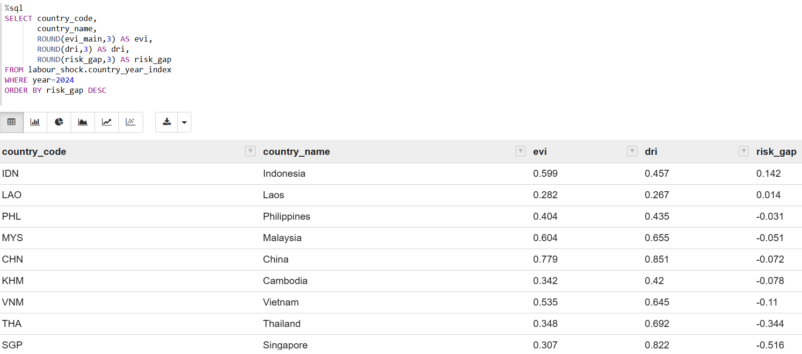


**China benchmark trend**


The Hive query on China's 2015–2024 EVI, DRI, and risk gap confirmed the same trend seen in the Python visualisation. China's risk gap started positive in 2015 and moved into negative territory by 2023–2024, driven by rapid DRI growth.


**Indicator group audit**


The core\_long table audit confirmed:


```text

EVI records = 450  (9 countries × 5 indicators × 10 years)

DRI records = 270  (9 countries × 3 indicators × 10 years)

```


This matches the expected long-format structure exactly.


Screenshots are in `04_bigdata_toolchain/screenshots/`.


### 5.3 Spark Independent Validation


This was the strongest reproducibility check in the toolchain validation. Rather than simply reading the Python-generated index results into Spark, I rebuilt the index calculation from the long-format core indicator data inside Zeppelin `%pyspark`.


The steps were:


1. Read `tool_core_long_2015_2024.csv` from HDFS

2. Map indicator codes to short variable names

3. Pivot the long table into a country-year wide table (90 rows)

4. Apply `MinMaxScaler` normalization across all 9 countries and 10 years

5. Calculate EVI, DRI, and risk gap using the same weights and formula as the Python pipeline

6. Compare Spark results against the Python-generated index table


**Index recalculation result**


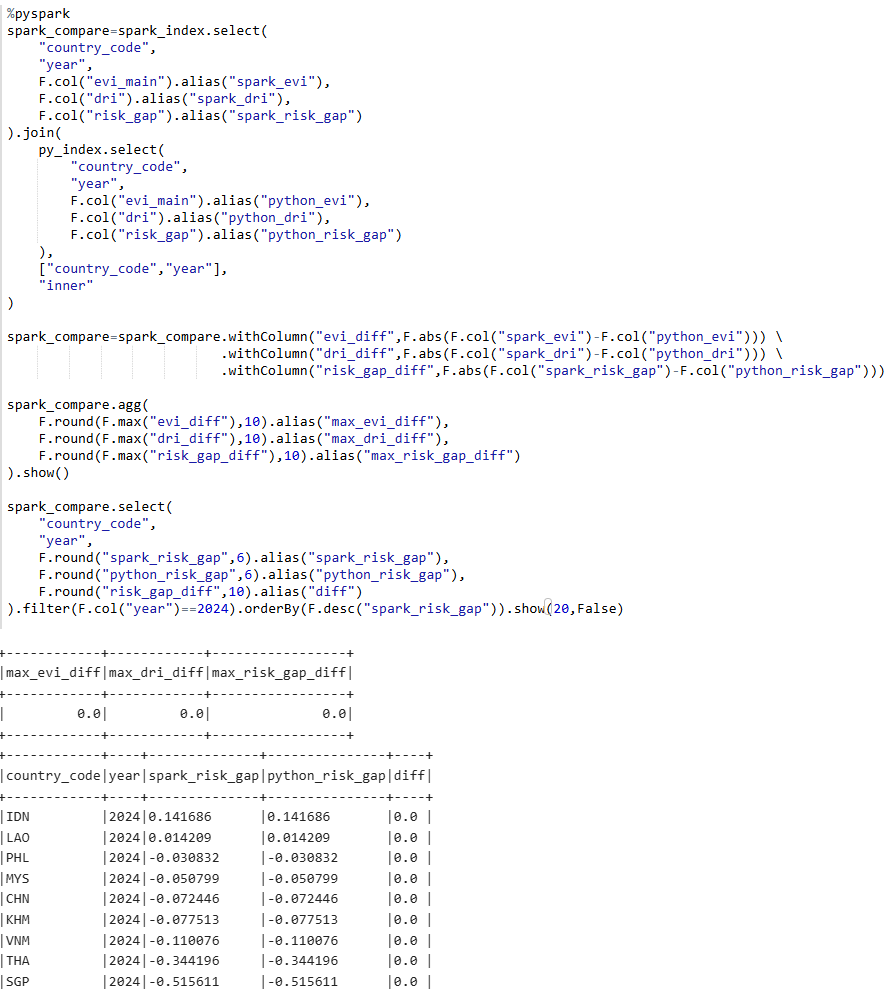


The comparison between Spark and Python produced:


```text

max_evi_diff = 0.0

max_dri_diff = 0.0

max_risk_gap_diff = 0.0

```


Spark reproduced the Python-generated EVI, DRI, and risk gap values with zero numerical difference. This confirms that the index calculation is correct and reproducible in an independent environment.


**2024 risk gap ranking**


The Spark-reproduced 2024 risk gap ranking matched the Python and Hive results exactly. Indonesia ranked first, Singapore ranked last.


**K-means reproducibility**


I also ran Spark MLlib K-means on the 2019–2024 SEA average EVI and DRI, using the same k=3 setup as the Python pipeline. The initial single-seed Spark result did not fully match the Python baseline, which showed that K-means is sensitive to random initialization, especially with only 8 countries and some borderline cases.


To address this, I tested multiple random seeds in Spark and selected the model with the lowest clustering cost. The best result used seed 3 with a cost of 0.0689.


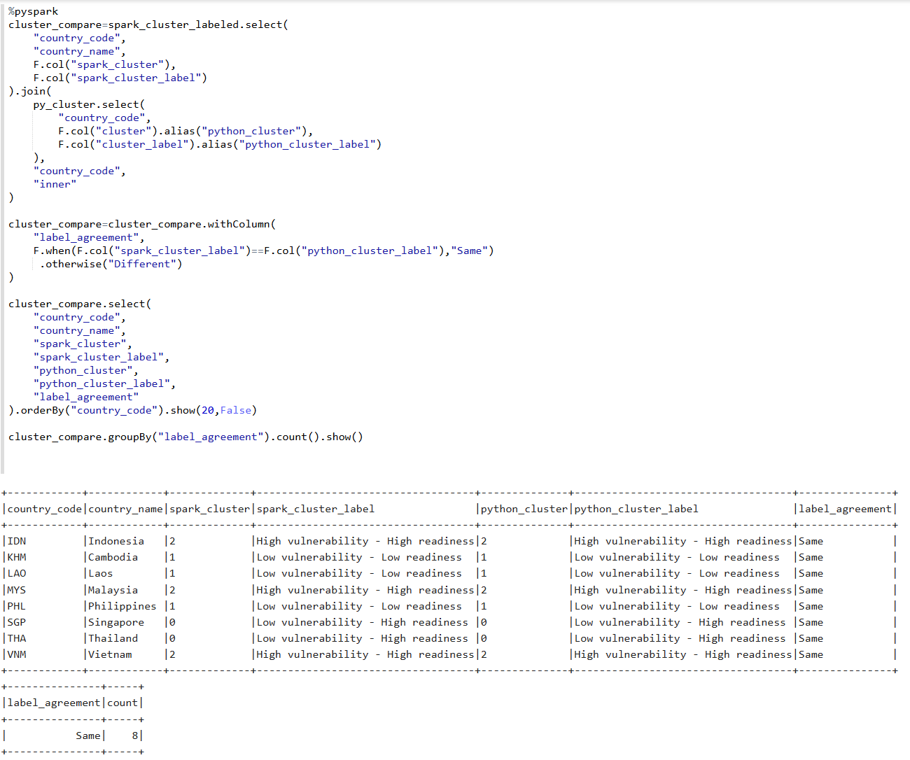


The final Spark MLlib K-means result was compared against the Python/sklearn baseline:


```text

Same = 8

Different = 0

```


Spark MLlib K-means reproduced the Python/sklearn clustering result with 8/8 agreement.


One important distinction: this 8/8 agreement is between Spark K-means and Python K-means — it confirms cross-environment reproducibility of the same method. It is separate from the quadrant vs K-means divergence discussed in Section 4.6, which reflects a methodological difference between two different analytical approaches.


**SEA yearly average trend**


Spark also reproduced the SEA yearly average EVI, DRI, and risk gap from 2015 to 2024. The regional average risk gap was positive in 2015 and turned negative around 2018–2019, consistent with the Python output.


Screenshots are in `04_bigdata_toolchain/screenshots/`.


### 5.4 Pig ETL Audit


Pig was used as a lightweight ETL audit tool to validate the structure of the long-format core indicator dataset.


During the sandbox execution, TEZ/YARN-based Pig execution was unstable, so the input CSV was copied from HDFS to the local working directory and Pig was run in local mode. This was an environment adaptation, not a change in audit logic. The same LOAD, FILTER, GROUP, and COUNT operations were applied regardless of execution mode.


The Pig script loaded the no-header long-format file, filtered records to the formal analysis period of 2015–2024, and grouped by indicator group and by country plus indicator group.


**Audit results**


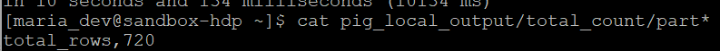


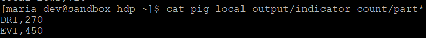


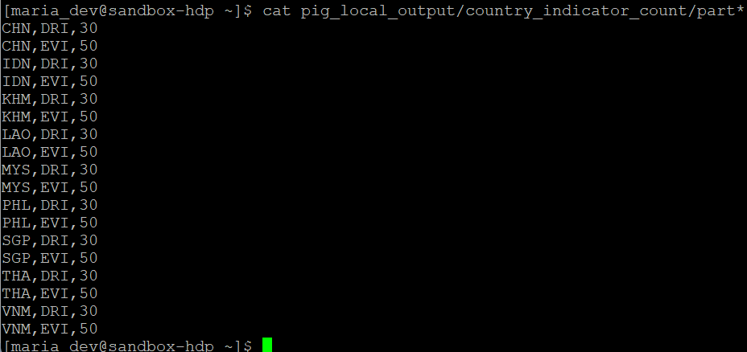


```text

Total rows = 720

EVI records = 450

DRI records = 270


Per country:

EVI = 50 rows (5 indicators × 10 years)

DRI = 30 rows (3 indicators × 10 years)

```


All counts matched the expected structure exactly, confirming that the long-format core dataset was complete and correctly structured before entering the Hive and Spark validation steps.


Screenshots are in `04_bigdata_toolchain/screenshots/`.


### 5.5 HBase Country-Year Profile Store


HBase was used as an optional NoSQL profile store for selected country-year index records. It was not used for aggregation or ranking — those tasks are handled by Hive and Spark. The purpose here was to demonstrate fast key-based access to individual country-year profiles.


**Table design**


```text

Table name: labour_profile

Row key:  country_code#year  (e.g. IDN#2024, CHN#2024, SGP#2024)


Column families:

meta → country_name, is_benchmark, year

vulnerability → evi_main

readiness → dri

result → risk_gap

```


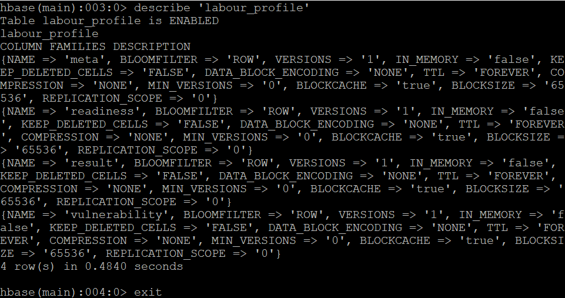


The column families were separated by analytical purpose — meta for identifiers, vulnerability and readiness for the two index dimensions, and result for the derived risk gap. This reflects the conceptual structure of the analysis.


**2024 profiles stored**


All 9 countries' 2024 profiles were written into HBase using a Python script that generated the put commands, which were then loaded via HBase shell. The final row count was 9.


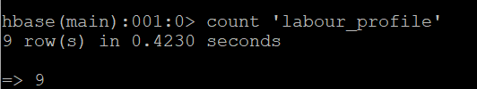


**Point query results**


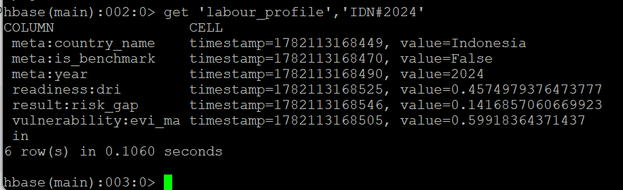

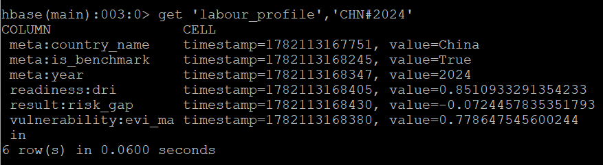

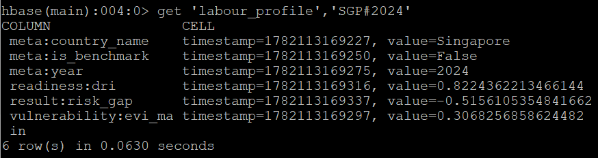

```text

IDN#2024: evi_main = 0.5992, dri = 0.4575, risk_gap = 0.1417

CHN#2024: evi_main = 0.7786, dri = 0.8511, risk_gap = -0.0724

SGP#2024: evi_main = 0.3068, dri = 0.8224, risk_gap = -0.5156

```


These results are consistent with the Python, Hive, and Spark outputs. Indonesia has the highest positive risk gap. China has very high EVI and very high DRI, with a slightly negative risk gap. Singapore has low EVI and very high DRI, with the most negative risk gap.


Screenshots are in `04_bigdata_toolchain/screenshots/`.


### 5.6 Toolchain Validation Summary


| Tool | Role | Key Result |
|------|------|-----------|
| Hive | SQL row count and ranking validation | Row counts matched, 2024 ranking consistent with Python |
| Spark | Independent index recalculation and K-means reproducibility | max_diff = 0.0, K-means 8/8 agreement |
| Pig | ETL audit of long-format dataset structure | 720 rows confirmed, EVI/DRI split correct |
| HBase | NoSQL country-year profile lookup | 9 profiles stored, point queries consistent with Python output |


The Hadoop toolchain was not used to replace or extend the main Python analysis. It was used to confirm that the results were computationally consistent, reproducible, structurally complete, and manageable in a Hadoop-based data environment.


This matters because the same results were checked from different angles: Python produced the analytical results, Hive validated them through SQL, Spark reproduced the calculations independently, Pig audited the input structure, and HBase demonstrated profile-level retrieval. The agreement across these tools makes the final findings more reliable than a single-notebook analysis.


## 6. Insights and Recommendations

The purpose of this section is not to give a general AI policy plan. The data cannot tell a country exactly what policy to implement. What it can do is show where the pressure is already visible, where the digital buffer is weak, and where a country may look safer than it actually is.

So I interpret the results as a priority map. Countries with high EVI and low DRI need the most urgent attention. Countries with high EVI and high DRI need to maintain their buffer. Countries with low EVI and low DRI need to build readiness before exposure rises. This is the practical value of combining risk gap, quadrant analysis, clustering, and trend results.

### 6.1 Indonesia — Most Urgent Case

Indonesia's 2024 numbers are the clearest in the dataset: EVI above 0.59, DRI around 0.46, risk gap at 0.14 — the highest positive risk gap among all nine countries. This has been consistent across the full 2015–2024 period, not just a single-year result.

Looking at the three DRI components, Indonesia's weakness is most visible in fixed broadband and internet penetration, both of which are below the SEA median. Mobile connectivity is relatively stronger but still not enough to compensate. This matters because the DRI gap is the specific reason the risk gap stays positive — if Indonesia's DRI were at Malaysia's level, the risk gap would already be negative.

The practical priority is fixed broadband and internet access before relying on large-scale workforce reskilling. Reskilling depends on connectivity. If workers and businesses do not have reliable digital access, adaptation programmes cannot scale. For Indonesia, infrastructure comes before training.

### 6.2 Philippines — The Borderline Case

The Philippines sits in an uncomfortable middle position. Its 2024 EVI is around 0.42 — above the SEA median — and its DRI is below the median. That puts it in the high EVI, low DRI quadrant alongside Indonesia.

But K-means groups the Philippines with Laos and Cambodia because its overall EVI-DRI distance is closer to that cluster than to Indonesia's position. This is the methodological divergence discussed in Section 4.6. The K-means label of "low vulnerability, low readiness" is technically accurate for the cluster centroid, but it understates the Philippines' actual EVI relative to Laos and Cambodia.

The concrete implication is that the Philippines should not be treated the same way as Laos or Cambodia in policy terms. Its vulnerability is higher than its cluster label suggests. The quadrant result — high EVI, low DRI — is the more conservative and more appropriate signal for practical risk assessment. For borderline cases like this, the safer assumption is the one that flags the risk, not the one that minimises it.

### 6.3 Singapore and Thailand — Similar Cluster, Different Reasons

Singapore and Thailand share a cluster, but their positions are not equivalent.

Singapore's 2024 DRI is around 0.82, the second highest in the dataset after China. Its EVI is around 0.31, well below the SEA median. The gap between DRI and EVI is the largest of any Southeast Asian country, meaning it has the most digital buffer relative to its vulnerability.

Thailand's DRI is around 0.69, which is strong — but it is driven heavily by mobile cellular subscriptions, where Thailand's value exceeds 100 per 100 people. Internet penetration and fixed broadband are comparatively lower. This means Thailand's DRI is somewhat top-heavy on mobile. If mobile-heavy connectivity does not translate into broader economic adaptability, the apparent DRI strength could overstate actual readiness.

For Singapore, the question is maintaining its advantage as AI deployment accelerates. For Thailand, the more useful question is whether its high DRI reflects genuine adaptive capacity or is partly a mobile penetration effect.

### 6.4 Malaysia and Vietnam — Buffer Exists, But Not Permanent

Malaysia and Vietnam both have above-median EVI and above-median DRI. In 2024, Malaysia's risk gap is slightly negative, while Vietnam's is more clearly negative. This is a better position than Indonesia or the Philippines, but it is not static.

The risk gap for both countries has improved over 2015–2024, but it tracks closely — DRI has been catching up with EVI rather than pulling significantly ahead. If the pace of AI adoption in manufacturing and services accelerates faster than digital infrastructure grows, the gap could turn positive again.

The specific concern for Malaysia is that its EVI is driven partly by industrial employment, which is a sector where automation exposure is real and increasing. Vietnam's situation is similar — high manufacturing employment with a DRI that has been improving but remains dependent on continued investment.

The practical point is that a negative risk gap is not a solved problem. It is a buffer that needs to be actively maintained.

### 6.5 Laos and Cambodia — The Timing Problem

Laos and Cambodia are among the lower-EVI countries in the Southeast Asian sample. But this reflects where they are in terms of industrialisation, not how protected they are. Their industrial employment shares are low, which keeps measured vulnerability down. Agricultural employment is included as a vulnerability signal in the EVI, but it is not enough on its own to push their scores above the regional median.

Their DRI is also the lowest in the dataset. Both are well below the SEA median.

The timing issue is this: Laos and Cambodia may not face strong AI-related labour displacement pressure right now, but as their economies industrialise and automation becomes more relevant, their EVI will rise. If their DRI has not improved significantly by then, they will move from low exposure to high exposure without the digital infrastructure to adapt. The cost of building that infrastructure increases once the urgency arrives.

### 6.6 China as a Benchmark — High Vulnerability, High Readiness

China's 2024 EVI is 0.78 — the highest in the dataset. Its DRI is 0.85 — also the highest. Risk gap is -0.07, slightly negative.

This is not a comfortable position masked by a good number. China has the most employment vulnerability in the dataset. The reason its risk gap is negative is that its digital readiness is also the strongest. These two things cancel out at the index level, but the underlying vulnerability is real.

For Southeast Asian countries with high EVI — Indonesia, Malaysia, Vietnam — China is a reference point in a specific sense: it shows that high DRI can offset high EVI, but only when DRI is very strong. A moderate DRI improvement is not enough if EVI is also rising. The gap has to be actively managed, not just assumed to be covered.

### 6.7 Regional Trend — Improvement on Average, Divergence in Practice

The SEA regional average risk gap turned negative around 2018–2019. That is a real trend — digital readiness has, on average, been growing faster than employment vulnerability across the region.

But Indonesia's risk gap in 2024 is still 0.14 — positive, and the highest in the dataset. The regional average includes Singapore at -0.52 and Thailand at around -0.33, which pull the average significantly. Indonesia's position is obscured by that average.

This is the most practical takeaway from the trend analysis: the regional improvement story is real, but it does not apply uniformly. Using the regional average to assess individual country risk would give a false sense of progress for the countries that need the most attention.


### 6.8 Priority Summary

The practical output of this analysis is a country priority map rather than a single ranking. A single risk gap ranking would put Indonesia first and Singapore last, but it would not explain why Thailand clusters with Singapore or why the Philippines should not be treated the same as Laos. The priority map uses both the quadrant result and the clustering result together.

Indonesia is the first-priority case. It has the clearest and most persistent positive risk gap in the dataset. The main issue is not that Indonesia has no digital development, but that digital readiness — especially fixed broadband and internet penetration — is not keeping up with employment vulnerability.

The Philippines is the second warning case because it is easy to underestimate. K-means places it with Laos and Cambodia, but the 2024 quadrant shows high EVI and low DRI. For risk assessment purposes, the Philippines should be monitored more like a high-risk country than a low-pressure country.

Malaysia and Vietnam are not immediate crisis cases, but they are not risk-free either. Their current advantage is that DRI offsets high EVI. The focus should be maintaining that buffer before AI exposure grows faster than digital readiness can follow.

Thailand and Singapore are in stronger positions, but for different reasons. Singapore is structurally strong across both dimensions. Thailand's readiness is more mobile-driven, so its next challenge is turning mobile connectivity into broader digital capacity.

Laos and Cambodia are early-stage readiness cases. Their current measured exposure is low, but their digital readiness is also the weakest in the dataset. They should not wait until industrial and automation exposure increases before investing in digital infrastructure.

The overall message from this analysis is that the same policy will not work equally across the region because the risk gaps come from different underlying causes. Indonesia's problem is DRI lagging behind EVI. The Philippines' problem is being misclassified as low-risk by clustering alone. Laos and Cambodia's problem is timing. These need different responses, and treating Southeast Asia as one uniform AI labour risk region would miss exactly this variation.


## 7. Conclusion

This project started with a simple question: are Southeast Asian countries ready for the kind of labour market disruption that AI may bring? The data does not show one regional answer. It shows uneven readiness across countries. And the differences between countries matter more than the regional average suggests.

The clearest finding is Indonesia. In the risk gap ranking, it has the highest positive value in 2024. In the quadrant analysis, it falls into the high EVI, low DRI category. In the trend analysis, its positive risk gap is not a one-year result but a persistent pattern across the full ten-year period. K-means also places Indonesia with the high-vulnerability countries, although its weaker DRI makes its individual profile more concerning than the group label suggests. If there is one country in Southeast Asia where the data most clearly points to an urgent readiness gap, it is Indonesia.

The second finding worth highlighting is the Philippines. It is easy to look at the K-means result — which groups it with Laos and Cambodia — and treat it as a low-pressure case. But the quadrant analysis tells a different story. The Philippines has above-median EVI and below-median DRI. That is the same quadrant as Indonesia. The difference between the two is one of degree, not of category. For practical risk assessment, the quadrant result is the more conservative and more appropriate signal.

The most useful methodological finding is that quadrant analysis and K-means clustering disagreed on exactly two countries: Indonesia and the Philippines. This disagreement is not a problem with the analysis — it is the analysis. It shows that threshold-based classification and distance-based clustering answer different questions. Quadrant analysis tells me whether a country has crossed a risk threshold. K-means tells me which countries have similar overall EVI-DRI profiles. For borderline countries, using only one method would have missed part of the story.

The Spark validation added something genuinely useful beyond just checking the numbers. I rebuilt the index calculation from the long-format core data inside Zeppelin — pivot, normalization, EVI, DRI, and risk gap — and compared it against the Python output. The maximum difference was zero. This means the index calculation was not dependent on one notebook or one software environment. Spark MLlib also reproduced the Python/sklearn K-means result with 8 out of 8 country labels matching. Hive validated the SQL-based rankings and row counts, Pig audited the long-format data structure, and HBase showed that selected country-year profiles could be stored and retrieved through key-based lookup.

The regional average risk gap turned negative around 2018–2019, which looks like progress. And it is progress — digital readiness has been improving across Southeast Asia. But Indonesia's risk gap in 2024 is still 0.14, the highest in the dataset, while Singapore sits at -0.52. The regional average sits between these two, and the average alone would suggest the region is in decent shape. It is not a uniform picture. The variation is the point.

There are real limitations to this analysis. The indicators are proxies — industrial employment is not the same as AI exposure, and mobile subscriptions are not the same as digital adaptability. The EVI weights are project-defined, not derived from empirical evidence about which sectors are actually most affected by AI. The DRI does not capture the quality or reliability of digital infrastructure, only its scale. The analysis also ends in 2024, before the most recent wave of large language model deployment has had time to show up clearly in labour market statistics. These limitations mean the results should be read as a structured comparison of relative positions and trends, not as precise predictions.

The practical output of this project is therefore not a prediction of the exact labour impact of AI. It is a differentiated readiness-gap map for Southeast Asia. Indonesia is the clearest urgent case. The Philippines is the case where risk can be underestimated if only clustering is used. Laos and Cambodia are less exposed for now, but weak in readiness. Malaysia and Vietnam have buffers, but those buffers depend on DRI continuing to grow. Singapore is the strongest Southeast Asian reference point, while China shows that high vulnerability can be offset only when readiness is also very strong. From this, we can conclude: the AI labour shock problem in Southeast Asia is not one regional problem with one regional answer. It is a set of different country-level readiness gaps that need different responses.